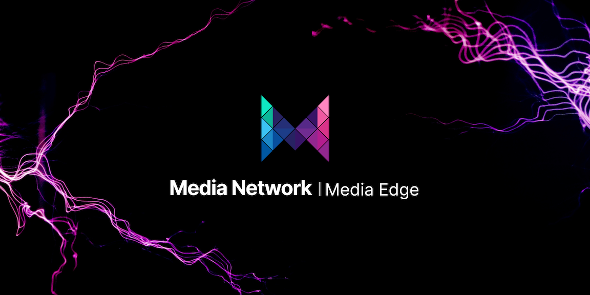

# Media Edge



[**Explore the docs »**](https://docs.media.network)  
[Use the dCDN](https://app.media.network)  
[Report Bug](https://github.com/mediafoundation/media-edge/issues)  
[Request Feature](https://github.com/mediafoundation/media-edge/issues)

- [Table of Contents](#table-of-contents)
  * [About Media Edge](#about-media-edge)
    + [Built With](#built-with)
  * [Getting Started](#getting-started)
    + [Software Prerequisites](#software-prerequisites)
    + [Installation](#installation)
  * [Usage & Troubleshooting](#usage--troubleshooting)
  * [Roadmap](#roadmap)
  * [Contributing](#contributing)
  * [License](#license)
  * [Contact](#contact)

## About Media Edge

Media Edge is a new and powerful software that allows CDN providers to create their content delivery network and sell their services in the decentralized Media Network marketplace. With the Media Edge, providers can easily set up their CDN networks, offer them within the Media Network marketplace, and get MEDIA rewards in exchange for the services provided.

## What is Media Edge?

Media Edge is an open-source software that serves as a web server and blockchain resource manager for CDN providers. It is a tool that simplifies the process of setting up a CDN network, and it includes all the necessary features to interact with the Media Network smart contracts from the provider stand point.

### Built With:

* [Ansible](https://www.ansible.com/)
* [Caddy](https://caddyserver.com/)
* [Elasticsearch](https://www.elastic.co/elasticsearch/)
* [Ethers](https://ethers.org/)
* [Express](https://expressjs.com/)
* [Filebeat](https://www.elastic.co/beats/filebeat)
* [hsd](https://github.com/handshake-org/hsd)
* [Kibana](https://www.elastic.co/kibana/)
* [Logstash](https://www.elastic.co/logstash/)
* [NodeJs](https://nodejs.org/)
* [PostgreSQL](https://www.postgresql.org/)
* [TweetNaCl.js](https://tweetnacl.js.org/)
* [Varnish](https://varnish-cache.org/)
* [web3.js](https://web3js.org/#/)

## Getting Started

Follow these simple example steps to get your Media Edge setup and running in no time.

### Software Prerequisites

* [Ansible](https://docs.ansible.com/ansible/latest/installation_guide/intro_installation.html#installing-ansible-on-specific-operating-systems) @ local computer
* [Debian 10 x64](https://www.debian.org/releases/buster/debian-installer/) @ target server(s)

### Installation

1. Clone the repo and submodule (abis)
  ```
  sh
  git clone https://github.com/mediafoundation/media-edge.git
  git submodule init
  git submodule update
  ```

2. Navigate to `ansible` folder
   ```sh
   cd ansible
   ```

3. Copy `hosts.example` to `hosts` and edit the file: replace with your server's IP addresses. You can add multiple servers (one per line) and also install origins or edges.
    ```sh
    [origin]
    origin ansible_host=192.168.0.170 ansible_ssh_private_key_file=~/.ssh/id_rsa ansible_ssh_user=root ansible_port=22
    [edge]
    edge ansible_host=192.168.0.171 ansible_ssh_private_key_file=~/.ssh/id_rsa ansible_ssh_user=root ansible_port=22
    edge ansible_host=192.168.0.172 ansible_ssh_private_key_file=~/.ssh/id_rsa ansible_ssh_user=root ansible_port=22
    ```

4. Copy `user_config.yml.example` to `user_config.yml` and edit with up your wallet and other settings, like provider domains or RPC endpoints.

5. Deploy Media Edges
    ```sh
    ansible-playbook deploy.yml -i hosts
    ```


<!-- USAGE EXAMPLES -->
## Usage & Troubleshooting

For more information, please refer to the [Media Edge Docs](https://docs.media.network/cdn-marketplace-edge).

<!-- ROADMAP -->
## Roadmap

- [X] First Release
- [ ] TBD
- [ ] TBD
- [ ] TBD

See the [open issues](https://github.com/mediafoundation/media-edge/issues) for a full list of proposed features (and known issues).

<!-- CONTRIBUTING -->
## Contributing

Contributions make the open-source community a fantastic place to learn, inspire, and create. Any contributions you make are **greatly appreciated**.

If you have a suggestion to improve this, please fork the repo and create a pull request. You can also simply open an issue with the tag "enhancement."
Don't forget to give the project a star! Thanks again!

1. Fork the Project
2. Create your Feature Branch (`git checkout -b feature/AmazingFeature`)
3. Commit your Changes (`git commit -m 'Add some AmazingFeature'`)
4. Push to the Branch (`git push origin feature/AmazingFeature`)
5. Open a Pull Request

<!-- LICENSE -->
## License

Distributed under the MIT License. See `LICENSE.txt` for more information.

<!-- CONTACT -->
## Contact

Media Foundation - [@Media_FDN](https://twitter.com/Media_FDN) - hello@media.foundation
